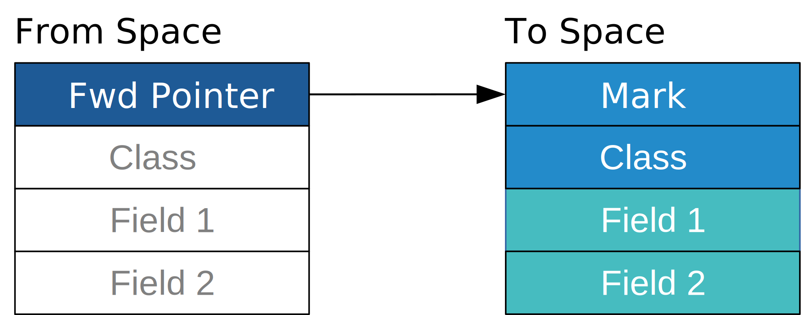
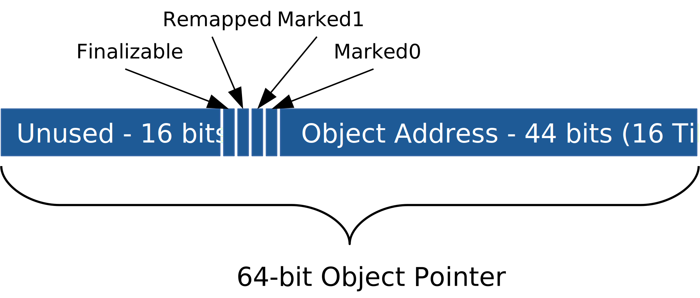
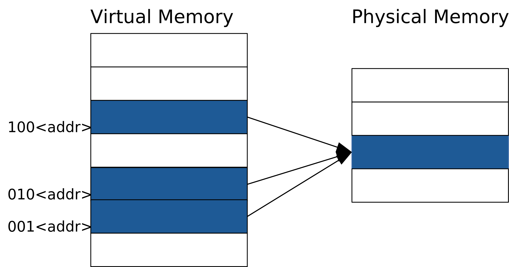

<!-- .slide: class="master01" -->

# Modern<br/>JVM<br/>Garbage<br/>Collection

---

<!-- .slide: class="master02" -->

## What to Expect

* Some GC theory
* New GCs in OpenJDK HotSpot
* How to choose and tune GC in OpenJDK HotSpot
* GC in containers

---

<!-- .slide: class="master02" -->
# Garbage Collector Theory

---

<!-- .slide: class="text-left" -->
## What Does a GC Do?

* Tracks every object in JVM Heap
* Removes unused objects


&nbsp; &nbsp; &rArr; Easy?

---

## GC Design Factors

<!-- .slide: class="text-left" -->
<div class="container">

<div class="col">

* Program throughput
* GC throughput
* Heap overhead
* Pause times

</div>
<div class="col">

* Pause frequency
* Pause distribution
* Allocation performance
* Compaction

</div>
</div>
&nbsp;

---

## GC Design Factors

<!-- .slide: class="text-left" -->
<div class="container">

<div class="col">

* Concurrency
* Scaling
* Tuning
* Warmup time

</div>

<div class="col">

* Page release
* Portability
* Compatibility

</div>
</div>

&nbsp; &nbsp; &rArr; Very hard, lots of tradeoffs

<small>References: <small>[1]</small></small>

[1]: https://blog.plan99.net/modern-garbage-collection-911ef4f8bd8e

---

<!-- .slide: class="text-left" -->
## Generational Hypothesis

* Empirical observation
* Weak: Most objects die young
* Strong: The older the object, the less chance it has to die 
* Notable exception: LRU caches

<small>References: <small>[1]</small></small>

[1]: http://gchandbook.org/

---

<!-- .slide: class="text-left" -->
## Throughput and Latency

<dl>
<dt>Throughput</dt>
<dd>% of time not spent in garbage collection</dd>
<dt>Latency</dt>
<dd>Responsiveness of an application, affected by GC pauses</dd>
</dl>

<small>References: <small>[1]</small></small>

[1]: https://docs.oracle.com/en/java/javase/11/gctuning/garbage-collector-implementation.html

---

<!-- .slide: class="text-left" -->
## STW, Parallel and Concurrent

<dl>
<dt>STW (Stop-The-World)</dt>
<dd>All app threads are stopped during GC</dd>
<dt>Concurrent</dt>
<dd>All app threads are running during GC</dd>
<dt>Parallel</dt>
<dd>GC uses multiple threads in STW and/or concurrent phases</dd>
</dl>

---

<!-- .slide: class="master02" -->
# OpenJDK HotSpot Garbage Collectors

---

<!-- .slide: class="text-left" -->
## JVM Ergonomics

<!-- .slide: class="text-left" -->
* JVM ergonomics selects GC if none specified <small>[1]</small>
<!-- * Based on architecture, CPU and memory -->
* Serial GC if 1 CPU or < 1792 MiB RAM <small>[2]</small>
* OpenJDK < 8u191 not fully aware of containers <small>[3]</small>
* GCs ergonomics auto-tune low-level params

[1]: https://docs.oracle.com/en/java/javase/11/gctuning/ergonomics.html
[2]: https://blog.oio.de/2020/01/13/high-performance-at-low-cost-choose-the-best-jvm-and-the-best-garbage-collector-for-your-needs/
[3]: https://merikan.com/2019/04/jvm-in-a-container/

---

<!-- .slide: class="text-left" -->
## OpenJDK 8 Available GCs

| GC         | Option              | Comment |
| ---------- | ------------------- | ------- |
| Serial     | -XX:+UseSerialGC        | default |
| Parallel   | -XX:+UseParallelGC      | default |
| CMS        | -XX:+UseConcMarkSweepGC | |
| G1         | -XX:+UseG1GC            | |
| Shenandoah | -XX:+UseShenandoahGC    | non-mainline backport |

<small>References: <small>[1] [2]</small></small>

[1]: https://docs.oracle.com/javase/8/docs/technotes/guides/vm/gctuning/collectors.html
[2]: https://wiki.openjdk.java.net/display/shenandoah/Main

---

<!-- .slide: class="text-left" -->
## OpenJDK 11 Available GCs

| GC         | Option                    | Comment |
| ---------- | ------------------------- | ------- |
| Serial     | -XX:+UseSerialGC        | default |
| Parallel   | -XX:+UseParallelGC      | |
| CMS        | -XX:+UseConcMarkSweepGC | deprecated |
| G1         | -XX:+UseG1GC            | default |
| Shenandoah | -XX:+UseShenandoahGC    | non-mainline backport |
| ZGC        | -XX:+UseZGC             | exp., Linux x86_64 only |
| Epsilon    | -XX:+UseEpsilonGC       | experimental |

<small>References: <small>[1] [2] [3]</small></small>

[1]: https://docs.oracle.com/en/java/javase/11/gctuning/available-collectors.html
[2]: https://wiki.openjdk.java.net/display/shenandoah/Main
[3]: https://dzone.com/articles/cms-deprecated-next-steps

---

<!-- .slide: class="text-left" -->
## Epsilon GC

* No-op gc, does not collect garbage at all
* Useful for:
  * Measurements
  * Short living processes
  * Garbage-free applications

<small>References: <small>[1] [2]</small></small>

[1]: https://blogs.oracle.com/javamagazine/epsilon-the-jdks-do-nothing-garbage-collector
[2]: https://www.baeldung.com/jvm-epsilon-gc-garbage-collector

---

<!-- .slide: class="text-left" -->

## GC Concurrency

 <table>
  <tr>
    <th></th>
    <th>Young Generation</th>
    <th colspan="2">Old Generation</th>
  </tr>
  <tr>
    <td>Parallel</td>
    <td><span class="redbg">Copy</span></td>
    <td style="border-right: none"><span class="redbg">Mark</span></td>
    <td><span class="redbg">Compact<span></td>
  </tr>
  <tr>
    <td>CMS</td>
    <td><span class="redbg">Copy</span></td>
    <td style="border-right: none"><span class="greenbg">Conc Mark</span></td>
    <td><span class="greenbg">Conc Sweep<span></td>
  </tr>
  <tr>
    <td>G1</td>
    <td><span class="redbg">Copy</span></td>
    <td style="border-right: none"><span class="greenbg">Conc Mark</span></td>
    <td><span class="redbg">Compact<span></td>
  </tr>
  <tr>
    <td>Shenandoah</td>
    <td><span>&mdash;</span></td>
    <td style="border-right: none"><span class="greenbg">Conc Mark</span></td>
    <td><span class="greenbg">Conc Compact<span></td>
  </tr>
  <tr>
    <td>ZGC</td>
    <td><span>&mdash;</span></td>
    <td style="border-right: none"><span class="greenbg">Conc Mark</span></td>
    <td><span class="greenbg">Conc Compact<span></td>
  </tr>
</table>

<br>

 <table>
  <tr>
    <td style="border-right: none"><span class="redbg"></span>&nbsp; Stop-The-World</td>
    <td><span class="greenbg"></span>&nbsp; Concurrent with application</td>
  </tr>
</table>

<small>References: <small>[1]</small></small>

[1]: https://assets.ctfassets.net/oxjq45e8ilak/709UsobBpBGHxaZ0z6MNvH/1d75677b26f1b7c9a71150c372645ad8/100746_367617808_Simone_Bordet_Concurrent_Garbage_collectors_ZGC__Shenandoah.pdf

---

<!-- .slide: class="text-left" -->
## Concurrent GCs

* Marking and compaction run concurrently
* Coordination between GC & app through barriers
* STW pauses for root set scan and cleanup
* Pauses are short and predictable
* Better scalability for large heaps

---

<!-- .slide: class="text-left" -->
## Barriers

* Machine code injected by JIT
* Additional metadata needed for coordination
* Throughput reduction
  * Predictable
  * Can be offset with more resources

---

<!-- .slide: class="master02" -->
# Shenandoah Garbage Collector

---

<!-- .slide: class="text-left" -->
## Shenandoah Garbage Collector

* Developed by Red Hat
* Named after Shenandoah national park
* Originally based on G1 GC
* Pause times independent of heap and live-set size

---

<!-- .slide: class="text-left" -->
## Shenandoah Garbage Collector

* Single generation, multiple regions
* Concurrent marking with SATB like G1
* Concurrent compaction:
  * v1: brooke pointers, read and write barriers
  * v2: on-heap forwarding pointers, load barriers

---

<!-- .slide: class="text-left" -->
## Shenandoah Garbage Collector

* Barrier loop optimizations
* Multiple heuristics and failure modes
* Not included in Oracle builds

<small>References: <small>[1] [2] [3] [4] [5] [6]<small></small>

[1]: https://wiki.openjdk.java.net/display/shenandoah/Main
[2]: https://shipilev.net/talks/jugbb-Sep2019-shenandoah.pdf
[3]: https://assets.ctfassets.net/oxjq45e8ilak/709UsobBpBGHxaZ0z6MNvH/1d75677b26f1b7c9a71150c372645ad8/100746_367617808_Simone_Bordet_Concurrent_Garbage_collectors_ZGC__Shenandoah.pdf
[4]: https://jaxlondon.com/wp-content/uploads/2019/11/OpenJDK_-_in_the_new_Age_of_concurrent_Garbage_Collectors.pdf
[5]: https://blog.plan99.net/modern-garbage-collection-part-2
[6]: https://developers.redhat.com/blog/2019/04/19/not-all-openjdk-12-builds-include-shenandoah-heres-why/

---

## On-Heap Forwarding Pointers
<!-- .slide: class="text-left" -->

  <!-- .element height="125%" width="125%" -->

<small>References: <small>[1] [2]<small></small>

[1]: https://shipilev.net/talks/jugbb-Sep2019-shenandoah.pdf
[2]: https://assets.ctfassets.net/oxjq45e8ilak/709UsobBpBGHxaZ0z6MNvH/1d75677b26f1b7c9a71150c372645ad8/100746_367617808_Simone_Bordet_Concurrent_Garbage_collectors_ZGC__Shenandoah.pdf

---

<!-- .slide: class="text-left" -->
## Load (Reference) Barriers

Extra code when object reference is loaded from heap:
<!-- .element style="margin-bottom: -1.5rem; margin-top: -2rem;" --->

```java
Object obj2 = obj.field1;  // Loading an object reference from heap
// Load barrier needed here

Object obj3 = obj2;        // No barrier, not a load from heap
obj.doSomething();         // No barrier, not a load from heap
int i = obj.field2;        // No barrier, not an object reference
```

Optimized for common case

<small>References: <small>[1]<small></small>

[1]: http://cr.openjdk.java.net/~pliden/slides/ZGC-FOSDEM-2018.pdf

---

<!-- .slide: class="text-left" -->
## Shenandoah Load Barrier

Pseudocode:
<!-- .element style="margin-bottom: -1.5rem;" --->
```python
load_reference_barrier(addr):
  if in_evac_phase() and in_collection_set(addr) and !is_forwarded(addr):
    new_addr = copy_object(addr)
    if cas_fwd_pointer(addr, new_addr):
      return new_addr
    else:
      return get_fwd_pointer(addr)  # Another thread copied object
```

<small>References: <small>[1] [2]</small></small>

[1]: https://shipilev.net/talks/jugbb-Sep2019-shenandoah.pdf
[2]: https://assets.ctfassets.net/oxjq45e8ilak/709UsobBpBGHxaZ0z6MNvH/1d75677b26f1b7c9a71150c372645ad8/100746_367617808_Simone_Bordet_Concurrent_Garbage_collectors_ZGC__Shenandoah.pdf

---

<!-- .slide: class="master02" -->
# Z Garbage Collector

---

<!-- .slide: class="text-left" -->
## Z Garbage Collector

* Developed by Oracle, initially proprietary
* Inspired by patented Azul C4 GC
* Pause times independent of heap and live-set size
* Single generation, multiple regions

---

<!-- .slide: class="text-left" -->
## Z Garbage Collector

* Concurrent marking and compaction:
  * Load barriers and colored pointers
    * 64 bit only
    * no compressed oops
  * off-heap forward pointers

---

<!-- .slide: class="text-left" -->
## Z Garbage Collector

* Failure modes not documented
* Windows and MacOS support in JDK 14+

<small>References: <small>[1] [2] [3] [4]</small></small>

[1]: https://wiki.openjdk.java.net/display/zgc/Main
[2]: http://cr.openjdk.java.net/~pliden/slides/ZGC-FOSDEM-2018.pdf
[3]: https://assets.ctfassets.net/oxjq45e8ilak/709UsobBpBGHxaZ0z6MNvH/1d75677b26f1b7c9a71150c372645ad8/100746_367617808_Simone_Bordet_Concurrent_Garbage_collectors_ZGC__Shenandoah.pdf
[4]: https://jaxlondon.com/wp-content/uploads/2019/11/OpenJDK_-_in_the_new_Age_of_concurrent_Garbage_Collectors.pdf

---

## Colored Pointers
<!-- .slide: class="text-left" -->

  <!-- .element height="125%" width="125%" -->

<small>Object address size was changed from 42 to 44 bits in JDK 13 <small>[1]</small></small>

[1]: https://wiki.openjdk.java.net/display/zgc/Main

---

## Heap Multi-Mapping on x86_64

<!-- .slide: class="text-left" -->

  <!-- .element height="125%" width="125%" -->


<small>References: <small>[1] [2]</small></small>

[1]: http://cr.openjdk.java.net/~pliden/slides/ZGC-FOSDEM-2018.pdf
[2]: https://assets.ctfassets.net/oxjq45e8ilak/709UsobBpBGHxaZ0z6MNvH/1d75677b26f1b7c9a71150c372645ad8/100746_367617808_Simone_Bordet_Concurrent_Garbage_collectors_ZGC__Shenandoah.pdf

---

<!-- .slide: class="text-left" -->
## ZGC Load Barrier

Pseudo code:
```python
load_reference_barrier(addr):
  if color(addr) is bad:
    return slow_path(addr)  # mark/relocate/remap, depends on gc phase
```

<small>References: <small>[1] [2]</small></small>

[1]: http://cr.openjdk.java.net/~pliden/slides/ZGC-FOSDEM-2018.pdf
[2]: https://assets.ctfassets.net/oxjq45e8ilak/709UsobBpBGHxaZ0z6MNvH/1d75677b26f1b7c9a71150c372645ad8/100746_367617808_Simone_Bordet_Concurrent_Garbage_collectors_ZGC__Shenandoah.pdf

---

<!-- .slide: class="master02" -->
# Choosing and Tuning GCs

---

<!-- .slide: class="text-left" -->
## Notable GC tradeoffs

* Throughput vs latency
* Throughput vs heap size
* Latency vs heap size

---

<!-- .slide: class="text-left" -->
## When to use which GC?

| Criteria | GC |
| -------------------------------------- | -- |
| Heap &le; 100 MiB                      | Serial |
| Single CPU, long pauses ok             | Serial       |
| Maximum throughput, long pauses ok     | Parallel |
| Minimum latency, reduced throughput ok | Shenandoah or ZGC |
| Large heap, long pauses not ok         | Shenandoah or ZGC |
| Slow hardware, long pauses not ok      | Shenandoah (or ZGC?) |
| Balanced / otherwise                   | G1 |

<small>References: <small>[1] [2]</small></small>

[1]: https://docs.oracle.com/en/java/javase/11/gctuning/available-collectors.html
[2]: https://shipilev.net/talks/jugbb-Sep2019-shenandoah.pdf

---

<!-- .slide: class="text-left" -->
## Garbage Collector Design Goals

| GC         | Throughput | Pause time |
| ---------- | ---------- | ---------- |
| Serial     | 99%        | &mdash;    |
| Parallel   | 99%        | &mdash;    | 
| G1         | 90%        | 200 ms     |
| Shenandoah | 85%        | 10 ms      |
| ZGC        | 85%        | 10 ms      |
| Epsilon    | 100%       | 0 ms       |

<small><small>List actual values: **-XX:+UnlockDiagnosticVMOptions -XX:+PrintFlagsFinal**</small></small>
<small>References: <small>[1] [2] [3]</small></small>

[1]: https://www.oracle.com/technical-resources/articles/java/g1gc.html
[2]: https://wiki.openjdk.java.net/display/shenandoah/Main
[3]: https://wiki.openjdk.java.net/display/zgc/Main

---

<!-- .slide: class="text-left" -->
## Serial GC Tuning

* Throughput goal not met:
  * Increase heap size <small>[1]</small>
* Pauses too long:
  * Choose different GC

[1]: https://docs.oracle.com/en/java/javase/11/gctuning/ergonomics.html

---

<!-- .slide: class="text-left" -->
## Parallel GC Tuning

* Throughput goal not met:
  * Increase heap size <small>[1]</small>
* Pauses too long:
  * Set pause-time Goal <small>[1]</small>

[1]: https://docs.oracle.com/en/java/javase/11/gctuning/parallel-collector1.html

---

<!-- .slide: class="text-left" -->
## G1 GC Tuning

* Throughput too low:
  * Increase heap size <small>[1]</small>
  * Increase pause-time goal <small>[1]</small>
* Pauses too long:
  * Decrease pause-time goal <small>[1]</small>
  * Disable string deduplication <small>[2]</small>

[1]: https://docs.oracle.com/en/java/javase/11/gctuning/garbage-first-garbage-collector-tuning.html
[2]: https://eng.uber.com/jvm-tuning-garbage-collection/

---

<!-- .slide: class="text-left" -->
## ZGC Tuning

* Set max heap size based on live-set & alloc rate
* Throughput too low:
  * Decrease number of GC threads
* Allocation failures:
  * Increase heap size
  * Increase GC threads

<small>References: <small>[1]</small></small>

[1]: https://wiki.openjdk.java.net/display/zgc/Main

---

<!-- .slide: class="text-left" -->
## Shenandoah Tuning

* Set max heap size based on live-set & alloc rate
* Allocation failures: 
  * Increase heap size
  * Change/tune heuristics to run GC sooner
  * Increase allocator thread pacing delay

<small>References: <small>[1]</small></small>

[1]: https://wiki.openjdk.java.net/display/shenandoah/Main

---

<!-- .slide: class="text-left" -->
## Monitoring GCs

* GCs provide detailed metrics in logs <small>[1]</small>
* GCs provide partial metrics via MBeans <small>[2] [3]</small>
* Each GC reports metrics differently
* Compare with GC logs to find what is reported

[1]: https://www.baeldung.com/java-verbose-gc
[2]: https://docs.oracle.com/javase/8/docs/jre/api/management/extension/com/sun/management/GarbageCollectorMXBean.html
[3]: https://docs.oracle.com/javase/8/docs/jre/api/management/extension/com/sun/management/GarbageCollectionNotificationInfo.html

---

<!-- .slide: class="text-left" -->
## Monitoring GCs

* Use tool like GCViewer to interpret logs <small>[1]</small>
* Export metrics to Prometheus with Micrometer <small>[2]</small>
  * Doesn't fully support concurrent GCs yet <small>[3]</small>
  * Reports all GC phases as pauses
* Compare with non-GC metrics <small>[4]</small>

[1]: https://github.com/chewiebug/GCViewer
[2]: https://micrometer.io/docs/registry/prometheus
[3]: https://github.com/micrometer-metrics/micrometer/blob/1.4.x/micrometer-core/src/main/java/io/micrometer/core/instrument/binder/jvm/JvmGcMetrics.java
[4]: https://medium.com/thron-tech/lessons-learned-about-monitoring-the-jvm-in-the-era-of-containers-47e7fe0b77dc

---

<!-- .slide: class="master02" -->
# Java GCs in Containers

---

<!-- .slide: class="text-left" -->
## JVM Ergonomics in Containers

* Same rules apply in containers since 8u191 <small>[1]</small>
  * Serial GC if 1 CPU or < 1792 MiB RAM
* Red Hat/fabric8 images use run-java.sh <small>[2]</small>
  * Defaults to Parallel GC on JVM < 10
  * Sets max heap size by default

[1]: https://merikan.com/2019/04/jvm-in-a-container/
[2]: https://github.com/fabric8io-images/run-java-sh/blob/master/fish-pepper/run-java-sh/fp-files/run-java.sh

---

<!-- .slide: class="text-left" -->
## Heap Size

* Optimize performance:
  * Set min heap size = max heap size
* Optimize cost:
  * Select GC with page release
    * G1 (JDK 12+) or Shenandoah or ZGC <small>[1] [2]</small>
  * Don't set heap size or min < max

[1]: https://jelastic.com/blog/tuning-garbage-collector-java-memory-usage-optimization/
[2]: https://www.techrepublic.com/article/java-12-whats-new-in-the-latest-version-of-the-programming-language/

---

<!-- .slide: class="text-left" -->
## Java Base Images

* Use TCK/JCK certified JDK builds
* OpenJDK 8:
```sh
registry.access.redhat.com/redhat-openjdk-18/openjdk18-openshift
fabric8/s2i-java:latest     # Same image based on CentOS
adoptopenjdk:8-jdk-hotspot  # 8-jre-hotspot also available
azul/zulu-openjdk-alpine:8  # 8-jre also available
```
<!-- .element style="margin-top: 1rem; margin-bottom: 1rem; line-height: 1.6em;" --->
* OpenJDK 11:
```sh
registry.access.redhat.com/openjdk/openjdk-11-rhel7
fabric8/s2i-java:latest-java11  # Same image based on CentOS
adoptopenjdk:11-jdk-hotspot     # 11-jre-hotspot also available
azul/zulu-openjdk-alpine:11     # 11-jre also available
```
<!-- .element style="margin-top: 1rem; margin-bottom: 1rem; line-height: 1.6em;" --->

---

<!-- .slide: class="text-left" -->
## GraalVM Native Image

* Little information available
* Simple generational GC, similar to parallel GC [[1]]
* Implemented in Java [[1]]
* Low-latency GC only in enterprise edition [[2]]

[1]: https://blogs.oracle.com/javamagazine/graalvm-native-images-in-containers
[2]: https://www.graalvm.org/docs/reference-manual/native-image/#low-latency-garbage-collection
---

<!-- .slide: class="text-left" -->
## Finalization

Finalization is deprecated. Instead use:

* Explicit clean-up method
* AutoClosable
* PhantomReference and ReferenceQueue

<small>References: <small>[1]</small></small>

[1]: https://unitstep.net/blog/2018/03/10/java-phantomreferences-a-better-choice-than-finalize/

---

<!-- .slide: class="text-left" -->
## What's Next

* Check references in slides
* Look at some benchmarks <small>[1]</small>
* Verify and tune GC in your apps
* Collect GC metrics in your apps
* Read more about GC Theory <small>[2]</small>

[1]: https://ionutbalosin.com/2019/12/jvm-garbage-collectors-benchmarks-report-19-12/
[2]: http://gchandbook.org/
